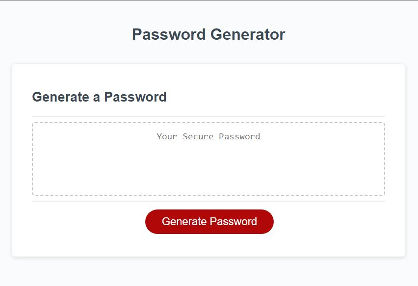
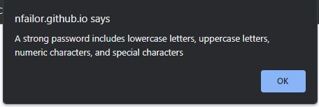
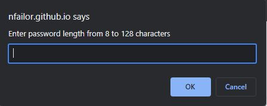
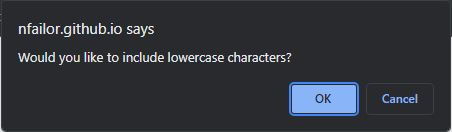
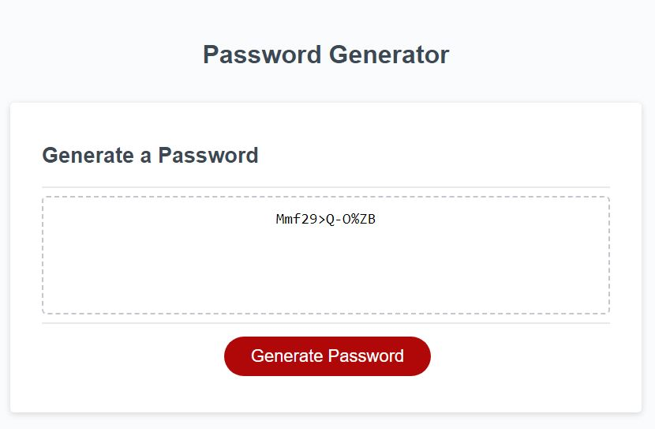

# Password Generator

## NAME
The name of this webpage is Password Generator.

## DESCRIPTION
This webpage is designed to prompt users for the requirements they would like their new password to be, and the form will generate a random password fit to the user's chosen requirements. 

## PROGRAMS USED
I used HTML and CSS to create the contents of this webpage and javascript to create the prompt. Git/Github were used as version control and deployed to Github Pages.

## INSTALLATION
This is a website only and does not need installation. it is currently hosted in github and you can access it at Github; https://nfailor.github.io/password-generator/

## USAGE
This webpage is used to generate random passwords. See webpage below:

In order to generate your new password, please click "Generate Password" and see below prompt:

Click okay, and it will then prompt the user to select a password length between 8 and 128 characters:

Enter a number between 8 and 128 to be sent to the next prompt:

If the user would like to include lowercase characters, they would select 'Ok.' If they would like to exclude lowercase characters, just select 'Cancel.' Upon making their choice, the user will find three similar prompts, addresses uppercase characters, numbers, and special characters. After all selections have been made, the prompt window will disappear, and the user's new password will be displayed inside the dash-lined box, as seen below:

## SUPPORT AND CONTRIBUTION
If you have any questions or concerns, please reach out to nfailor@gmail.com

## AUTHORS AND ACKNOWLEDGEMENT
I am Nick Failor, the author of this project.

## LICENSE
N/A